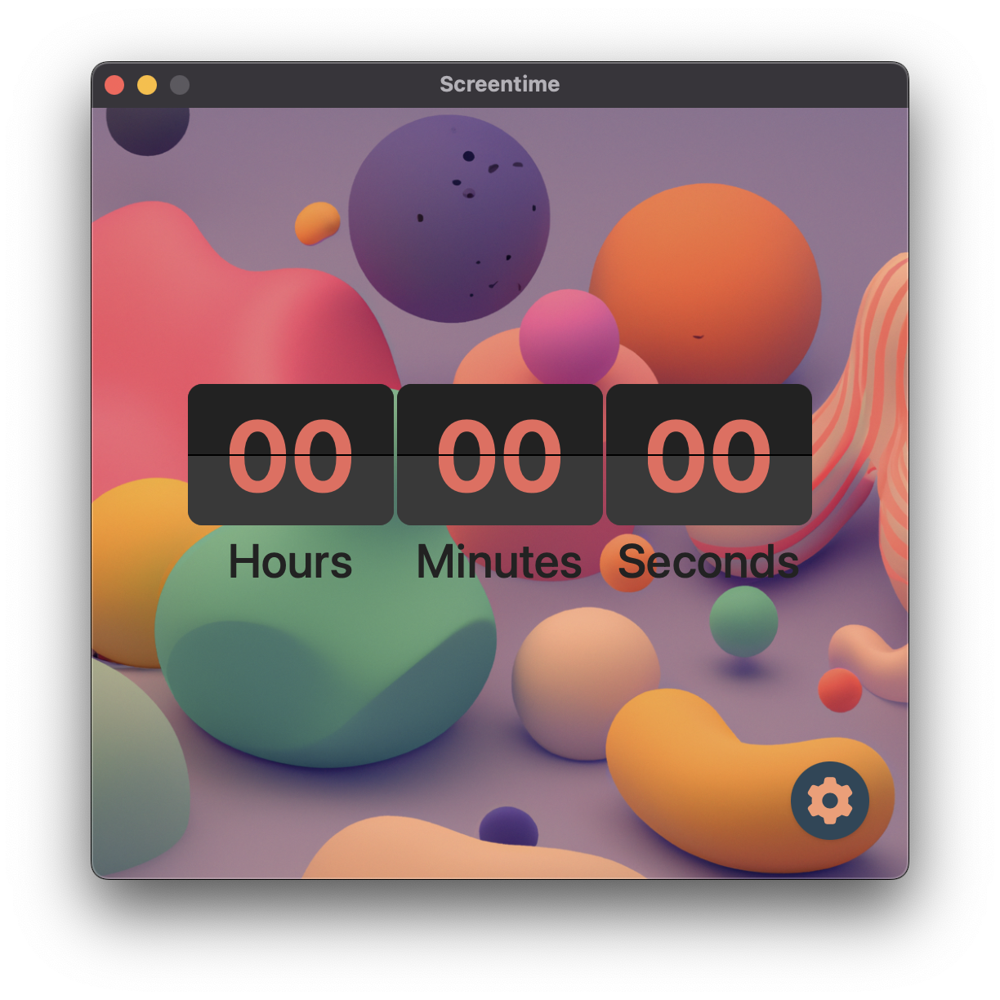

# Screentime

An intuitive desktop application to manage your screentime

## Getting Started

### Dependencies

- [Rust](https://rust-lang.org)
- [Just](https://just.systems)
- [NodeJs](https://nodejs.org)

### Installing

Download the pre-built application from the [release](https://github.com/opeolluwa/screentime/releases)

## License

This project is licensed under the [NAME HERE] License - see the LICENSE.md file for details
